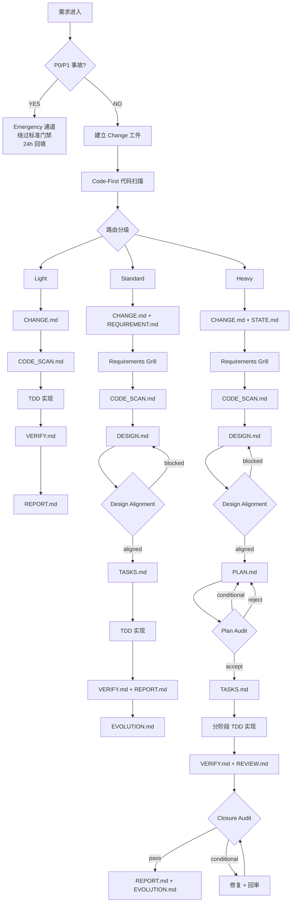
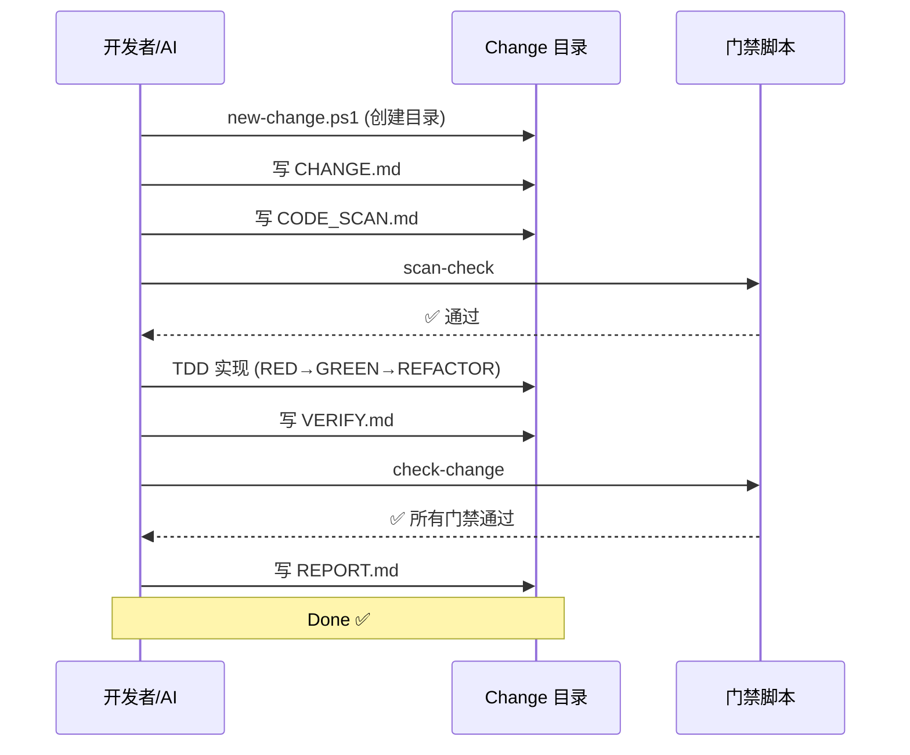
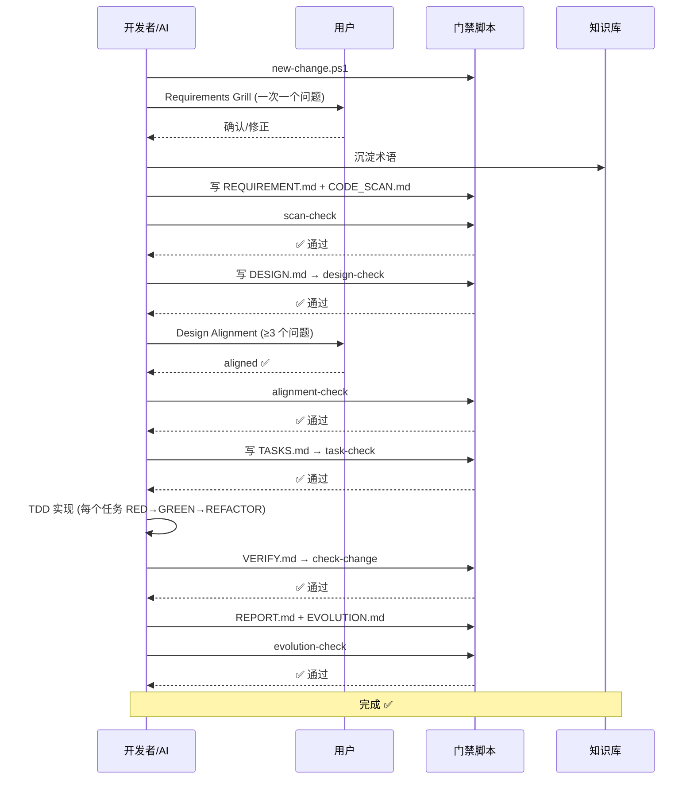
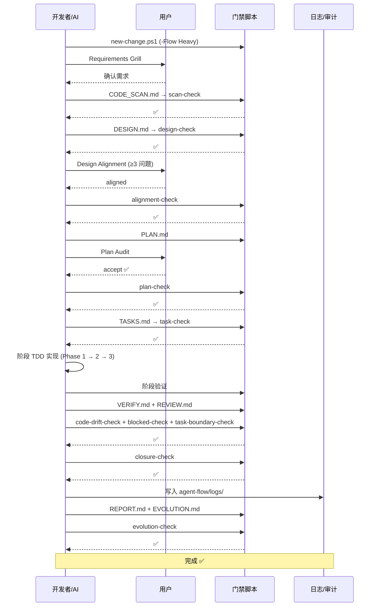
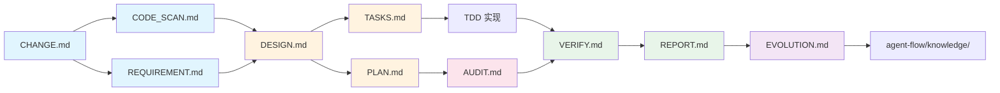
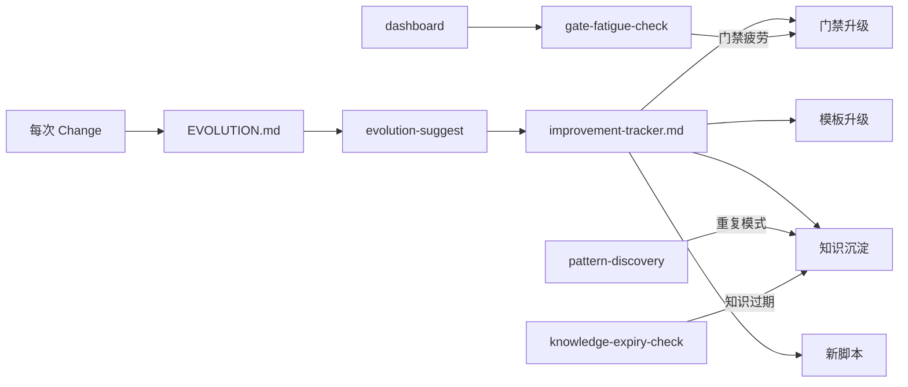

# agent-flow 流程架构图

> 可视化 agent-flow 的核心流程、路由判定和门禁时序。

---

## 1. 路由判定树

---

## 2. Light 流程门禁时序

---

## 3. Standard 流程门禁时序

---

## 4. Heavy 流程门禁时序

---

## 5. 工件依赖关系

---

## 6. 自动迭代循环

---

*文档生成时间: 2026-06*  
*更新: 每次 EVOLUTION.md 复盘后检查本图是否需要更新*
