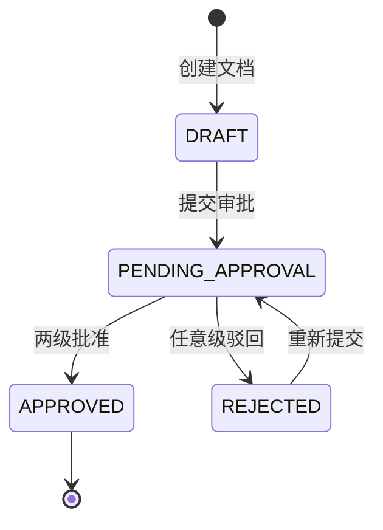

# Heavy Change Walkthrough: 文档审批工作流

> 这是一个完整的 Heavy 级别变更演练。以"文档审批工作流"为例，
> 展示从需求到收口的全流程。**加粗文字**为 AI 的思考过程。

---

## 目录

1. [Phase 0: Intake（第零阶段：建立 Change）](#phase-0-intake)
2. [Phase 1: Requirements Grill（第一阶段：需求对齐）](#phase-1-requirements-grill)
3. [Phase 2: Code Scan（第二阶段：代码扫描）](#phase-2-code-scan)
4. [Phase 3: Design（第三阶段：设计）](#phase-3-design)
5. [Phase 3.5: Design Alignment（设计对齐）](#phase-35-design-alignment)
6. [Phase 3.6: Plan（计划）](#phase-36-plan)
7. [Phase 3.7: Plan Audit（计划审计）](#phase-37-plan-audit)
8. [Phase 4: Tasks（任务分解）](#phase-4-tasks)
9. [Phase 5: Dev（TDD 实现）](#phase-5-dev)
10. [Phase 6: Verify（验证）](#phase-6-verify)
11. [Phase 7: Review（审查）](#phase-7-review)
12. [Phase 7.5: Closure Audit（收口审计）](#phase-75-closure-audit)
13. [Phase 8-10: Evolve + Log + Clear（演进+日志+清理）](#phase-8-10-evolve--log--clear)

---

## Phase 0: Intake

**AI 收到需求后，先读入口文件：**

```text
agent-flow/GO.md
agent-flow/manifest.yaml
agent-flow/core/router.md
agent-flow/core/principles.md
agent-flow/core/source-of-truth.md
```

**然后执行 `new-change` 创建工件目录：**

```powershell
agent-flow/scripts/new-change.ps1 -Name document-approval-workflow -Flow Heavy
```

**AI 思考：**
> 这是 Heavy 级别——新模块 + schema 变更 + 状态机 + 权限变更。
> 需要在 CHANGE.md 中明确写"非目标"和"影响范围"，避免 scope creep。

### 输出：`CHANGE.md` + `STATE.md`

- `CHANGE.md` 定义了需求范围、分级理由、影响范围
- `STATE.md` 记录了当前阶段（intake）和下一步（Requirements Grill）

---

## Phase 1: Requirements Grill

**AI 执行结构化追问（一次只问一个关键问题）：**

```text
问题 1: "审批链"的定义是什么？直接上级和部门负责人是串行还是并行？
推荐答案: 串行——先直接上级审批，通过后再转部门负责人。
用户确认: user-confirmed ✅

问题 2: 文档已有的状态有哪些？新状态如何兼容？
推荐答案: 当前是 DRAFT → PUBLISHED，新增 PENDING_APPROVAL → APPROVED / REJECTED。
用户确认: user-confirmed ✅

问题 3: 驳回后是否可以重新提交？如果可以，状态如何回退？
推荐答案: 可以重新提交，REJECTED → PENDING_APPROVAL。
用户确认: user-confirmed ✅
```

**AI 注意**：每个问题给出推荐答案，不要空问。能从代码读到的就不问用户。

### 输出：`REQUIREMENT.md`（含 AC 编号和术语表）

```
AC-01  用户提交文档后，文档状态变更为 PENDING_APPROVAL
AC-02  直接上级审批人可批准或驳回
AC-03  部门负责人审批人可批准或驳回
AC-04  两级审批通过后文档状态为 APPROVED
AC-05  驳回后文档状态为 REJECTED
```

**术语沉淀到 `agent-flow/knowledge/glossary.md`：**

```markdown
- 审批链: 文档需要经过的审批人序列（直接上级 → 部门负责人）
- 会签: 多人同时审批（不在本次范围）
- 或签: 任意一人审批通过即可（不在本次范围）
```

---

## Phase 2: Code Scan

**AI 先扫描代码，再写 CODE_SCAN.md：**

```text
扫描范围:
1. pom.xml — Maven 模块注册点
2. src/main/java/com/example/document/ — 现有 Document 模块
3. src/main/java/com/example/permission/ — 现有 Permission 模块
4. src/main/resources/db/migration/ — 现有迁移文件
5. src/main/java/com/example/common/ — 公共工具类

发现:
- DocumentService 已有 CRUD 操作
- 状态枚举为 DocumentStatus (DRAFT, PUBLISHED)
- PermissionService 有 @SaCheckPermission 注解模式
- 无现有审批相关代码
```

**运行 scan-check 确认扫描完成：**

```powershell
agent-flow/scripts/scan-check.ps1 -ChangeDir agent-flow/changes/document-approval-workflow -ProjectRoot . -Strict
```

### 输出：`CODE_SCAN.md`

```
Read files:
- pom.xml (模块注册)
- DocumentService.java (现有 CRUD)
- DocumentStatus.java (现有状态枚举)
- PermissionService.java (权限注解模式)
- V1__init_document.sql (现有 DDL)

Similar modules found:
- Document 模块可作为结构参考

Reusable abstractions:
- @SaCheckPermission 注解模式（权限控制通用）
- CommonResponse 统一返回格式

write_files:
- approval/ 目录下所有文件（新模块）
- document/DocumentStatus.java（新增状态）
- document/DocumentService.java（新增审批方法）
- db/migration/V2__approval.sql（新迁移）
```

---

## Phase 3: Design

**AI 写 DESIGN.md，必须包含：**

```text
1. 模块边界 — approval 模块独立，只依赖 document 和 permission
2. API 设计 — REST 路径、HTTP Method、权限码
3. 数据模型 — 审批表结构
4. 状态机 — Status Vocabulary + Status Mapping
5. Service 编排 — 审批流程
6. 错误处理 — 非法状态转换、无权限
7. 测试策略 — 单元 + 集成
8. 回滚策略 — 迁移可回滚
```

**运行 design-check：**

```powershell
agent-flow/scripts/design-check.ps1 -ChangeDir agent-flow/changes/document-approval-workflow
```

### 关键：状态机设计



**Status Mapping 表必须写清：**
| 旧状态 | 新状态 | 触发条件 | 兼容性 |
|--------|--------|---------|--------|
| DRAFT | PENDING_APPROVAL | 用户提交 | ✅ 向前兼容 |
| DRAFT | APPROVED | (不变) | 已有数据不受影响 |
| PUBLISHED | (不变) | — | 不涉及 |

---

## Phase 3.5: Design Alignment

**DESIGN.md 完成后，执行 Design Alignment / Grill：**

```text
问题 1: 审批表是否需要软删除？
推荐答案: 是——审批记录是审计证据，不应物理删除。使用 is_deleted 标记。
用户确认: user-confirmed ✅

问题 2: 两级审批如果其中一人是同一人（用户自审批），怎么处理？
推荐答案: 如果用户的直接上级和部门负责人在角色树中为同一人，只需要一次审批即可通过。
用户确认: user-confirmed ✅

问题 3: 审批历史是否需要追溯？
推荐答案: 需要——APPROVED 状态的文档也需要能看到审批链。审批表保留完整历史。
用户确认: user-confirmed ✅
```

**运行 alignment-check：**

```powershell
agent-flow/scripts/alignment-check.ps1 -ChangeDir agent-flow/changes/document-approval-workflow
```

**Verdict 必须是 `aligned` 才能继续。**

---

## Phase 3.6: Plan

**PLAN.md 分阶段执行：**

```text
Phase 1: 数据库迁移 + 数据模型（基础）
Phase 2: 审批模块 Service 层（核心逻辑）
Phase 3: Controller + 权限集成（API 层）
Phase 4: 文档状态机改造（集成）
Phase 5: 测试覆盖 + 收口（验证）
```

每个阶段必须有关闭条件和验证命令。

---

## Phase 3.7: Plan Audit

**AUDIT.md 的 Plan Audit 部分：**

```text
审计项:
1. ✅ 设计已对齐 (alignment-check passed)
2. ✅ 影响范围明确 (CHANGE.md)
3. ✅ 回滚策略完整 (DESIGN.md)
4. ⚠️ 数据迁移回滚脚本需要确认
5. ✅ 测试策略完整

Verdict: accept
```

**运行 plan-check：**

```powershell
agent-flow/scripts/plan-check.ps1 -ChangeDir agent-flow/changes/document-approval-workflow
```

**Verdict 必须是 `accept` 或用户明确接受 `conditional` 才能开始实现。**

---

## Phase 4: Tasks

**TASKS.md 每个任务必须有：**

| # | 目标 | AC 映射 | read_files | write_files | 验证 | 并行 |
|---|------|---------|-----------|-------------|------|------|
| T-01 | 审批表 DDL + 实体 | AC-01 | V1__init_document.sql | V2__approval.sql, ApprovalEntity.java | mvn compile | Y |
| T-02 | 审批 Service 实现 | AC-01~05 | ApprovalEntity.java | ApprovalService.java | mvn test | N |
| T-03 | 文档状态机改造 | AC-01, AC-04~05 | DocumentStatus.java | DocumentStatus.java, ApprovalService.java | mvn test | N |
| T-04 | 审批 Controller + 权限 | AC-02~05 | ApprovalService.java | ApprovalController.java | mvn test | Y |
| T-05 | 集成测试 + 端到端验证 | AC-01~05 | 所有实现文件 | ApprovalIntegrationTest.java | mvn test | N |

**运行 task-check：**

```powershell
agent-flow/scripts/task-check.ps1 -ChangeDir agent-flow/changes/document-approval-workflow
```

---

## Phase 5: Dev

**每个任务按 TDD 三步执行：**

```text
T-01: 审批表 DDL + 实体

🔴 RED: 写测试
- ApprovalEntityRepositoryTest.java
- 测试 save/findByDocumentId/软删除查询
- 运行 → test fails ❌
- 创建 git checkpoint: test: add approval entity tests

🟢 GREEN: 最小实现
- V2__approval.sql (CREATE TABLE approval_audit)
- ApprovalEntity.java (JPA Entity)
- ApprovalRepository.java
- 运行 → test passes ✅
- 创建 git checkpoint: feat: implement approval entity

🔵 REFACTOR: 重构
- 提取公共字段到 BaseEntity
- 优化查询方法命名
- 运行 → test still passes ✅
```

**每完成一个任务更新 TASKS.md 中的状态。**

---

## Phase 6: Verify

**VERIFY.md 包含：**

1. **AC Evidence 表** —— 每条 AC 绑定到测试文件或命令输出

| AC | 需求 | 证据类型 | 证据位置 | 结果 | 残余风险 |
|----|------|---------|---------|------|---------|
| AC-01 | 提交审批后状态变更 | 单元测试 | ApprovalServiceTest.java:42 | ✅ pass | 无 |
| AC-02 | 上级审批人可批准 | 集成测试 | ApprovalIntegrationTest.java:88 | ✅ pass | 无 |
| AC-03 | 上级审批人可驳回 | 集成测试 | ApprovalIntegrationTest.java:120 | ✅ pass | 无 |
| AC-04 | 两级通过后 APPROVED | 集成测试 | ApprovalIntegrationTest.java:150 | ✅ pass | 无 |
| AC-05 | 驳回后 REJECTED | 单元测试 | ApprovalServiceTest.java:75 | ✅ pass | 无 |

2. **Coverage Summary 表**

| Metric | Source | Value | Result | Notes |
|--------|--------|-------|--------|-------|
| Line Coverage | jacoco | 87% | ✅ pass | 超过 80% 阈值 |
| Branch Coverage | jacoco | 82% | ✅ pass | 边缘分支已覆盖 |

3. **门禁执行表**（记录每个门禁的执行结果）

---

## Phase 7: Review

**REVIEW.md 三层审查：**

1. **意图合规**：满足全部 5 条 AC，无越界修改
2. **架构合规**：新 approval 模块独立，复用 @SaCheckPermission 注解
3. **代码质量**：
   - Service 层有单元测试覆盖
   - 状态机边界条件（非法转换抛出异常）
   - 软删除已实现
   - 迁移可回滚

---

## Phase 7.5: Closure Audit

**AUDIT.md 的 Closure Audit 部分：**

所有门禁执行：
- ✅ scan-check
- ✅ design-check
- ✅ alignment-check
- ✅ task-check
- ✅ plan-check
- ✅ code-drift-check（设计声明 vs 代码一致）
- ✅ blocked-check（未触碰禁止规则）
- ✅ task-boundary-check（改动在 write_files 内）
- ✅ manifest-check
- ✅ evolution-check
- ✅ closure-check
- ✅ run-verify --all

**Verdict: pass**

---

## Phase 8-10: Evolve + Log + Clear

1. **EVOLUTION.md**: 复盘
   - 状态机设计模板需要增加 Legacy Compatibility 示例
   - 新增门禁：无
   - 知识沉淀：审批流设计模式 → pitfalls.md

2. **agent-flow/logs/2026/MM-DD.md**: 日志记录

3. **agent-flow/knowledge/known-good-baselines.md**: 更新基线

4. **运行 `manage_plan clear`**: 清空计划面板

---

## 完整门禁清单

以下是 Heavy 流程中每个阶段需要运行的门禁：

| 阶段 | 门禁 |
|------|------|
| Code Scan 后 | `scan-check` |
| Design 后 | `design-check` |
| Design Alignment 后 | `alignment-check` |
| Plan Audit 后 | `plan-check` |
| Tasks 后 | `task-check` |
| 验证 | `code-drift-check` + `blocked-check` + `task-boundary-check` + `ac-check` + `coverage-check` |
| 收口 | `closure-check` + `manifest-check` + `emergency-check` + `evolution-check` |
| 机器汇总 | `check-change -Closure` |

---

*本 walkthrough 基于 `examples/heavy-change/` 中的工件。建议配合 `agent-flow/README.md` 和 `docs/learning-path.md` 一起阅读。*
